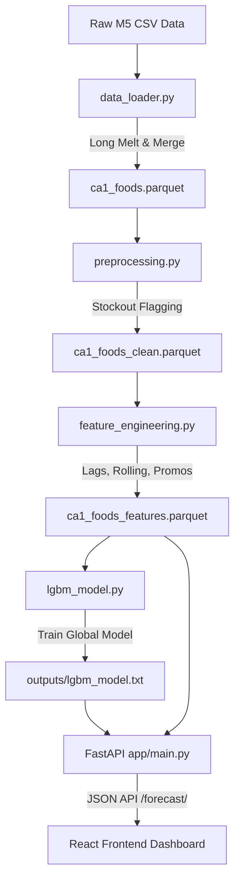

# Demand Forecasting & Intelligent Inventory Planner

[](https://www.python.org/)
[](https://fastapi.tiangolo.com/)
[](https://reactjs.org/)
[](https://vitejs.dev/)
[](https://lightgbm.readthedocs.io/)
[](https://github.com/astral-sh/uv)

A complete end-to-end Machine Learning and Operations Research application designed to bridge the gap between predictive demand forecasting and automated supply chain replenishment decisions. Using raw retail sales data, this system builds a feature-engineered pipeline, trains multiple time-series models (Prophet, SARIMA, LightGBM), computes optimal inventory stocking metrics, and serves them through a modern React dashboard.

---

## 📈 Business Impact & Simulation

Traditional inventory systems use historical rolling averages to place restock orders, which lags behind demand spikes and wastes capital on overstocking. 

By applying a **global LightGBM forecasting model** combined with **operations research safety stock calculations**, this application delivers major business value:

| Metric | Naive Rolling Avg Baseline | Our LightGBM Inventory Planner | Business Improvement |
| :--- | :---: | :---: | :---: |
| **Simulated Stockout Days (28-day window)** | 4 Days | **1 Day** | **75% reduction in stockouts** |
| **Inventory Forecast MAE (`FOODS_3_090`)** | 17.47 | **11.13** | **36.3% prediction error reduction** |
| **Operational Efficacy** | Reactive & slow | **Proactive & automated** | Drastically reduced capital lockup |

> [!TIP]
> The simulation dynamically scales with the **Service Level (Z-score)** target. A 95% service level guarantees that the inventory plan will prevent stockouts 95% of the time, adjusting the safety stock buffer according to forecasted demand volatility.

---

## 🏗️ System Architecture & Data Pipeline

The pipeline is fully automated and modular, starting from raw transactional logs to a served web interface.



### 1. Data Loader & Processing
* **Script**: [src/data_loader.py](file:///c:/Users/Dell/OneDrive/Documents/demand-forecasting-inventory/src/data_loader.py)
* **Function**: [merge_all](file:///c:/Users/Dell/OneDrive/Documents/demand-forecasting-inventory/src/data_loader.py#L45)
* Loads raw M5 competition datasets (`sales_train_evaluation.csv`, `calendar.csv`, `sell_prices.csv`) in `data/raw/`.
* Melts wide daily sales data into long format (one row per item, store, and date).
* Restricts analysis to a single store/category (e.g., `CA_1`, `FOODS`) to remain fast and memory-efficient.

### 2. Smart Preprocessing & Stockout Detection
* **Script**: [src/preprocessing.py](file:///c:/Users/Dell/OneDrive/Documents/demand-forecasting-inventory/src/preprocessing.py)
* **Function**: [clean_for_modeling](file:///c:/Users/Dell/OneDrive/Documents/demand-forecasting-inventory/src/preprocessing.py#L58)
* **Problem**: Standard forecasting models treat consecutive zeroes as "zero demand." However, if a product is out of stock (stockout), the zero sales indicate *suppressed demand*, not *absent demand*.
* **Solution**: Flags stockouts where daily sales are 0, a price is active (item was listed), and the consecutive zero streak is $\ge 14$ days. The model retains these flags to learn demand suppression instead of predicting actual zero demand.

### 3. Feature Engineering
* **Script**: [src/feature_engineering.py](file:///c:/Users/Dell/OneDrive/Documents/demand-forecasting-inventory/src/feature_engineering.py)
* **Function**: [build_features](file:///c:/Users/Dell/OneDrive/Documents/demand-forecasting-inventory/src/feature_engineering.py#L83)
* Generates features to convert temporal dynamics into standard regression tabular structures:
  * **Lags**: Sales from 1, 7, 14, and 28 days ago.
  * **Rolling Windows**: Rolling mean and standard deviation over 7, 14, and 28 days (lagged by 1 to prevent data leakage).
  * **Calendar**: Day of week, weekend indicator, month, active event flags, and SNAP benefits day.
  * **Promotions**: Tracks price differentials to flag promotional markdowns.

### 4. Operations Research & Inventory Plan
* **Script**: [src/inventory.py](file:///c:/Users/Dell/OneDrive/Documents/demand-forecasting-inventory/src/inventory.py)
* **Functions**:
  * [compute_safety_stock](file:///c:/Users/Dell/OneDrive/Documents/demand-forecasting-inventory/src/inventory.py#L24)
  * [compute_reorder_point](file:///c:/Users/Dell/OneDrive/Documents/demand-forecasting-inventory/src/inventory.py#L35)
  * [simulate_stockouts](file:///c:/Users/Dell/OneDrive/Documents/demand-forecasting-inventory/src/inventory.py#L62)
* Translates forecasted sales into stock levels using statistical inventory optimization:
  $$\text{Safety Stock} = Z \times \sigma_{\text{demand}} \times \sqrt{\text{Lead Time}}$$
  $$\text{Reorder Point} = (\mu_{\text{demand}} \times \text{Lead Time}) + \text{Safety Stock}$$
  *Where $Z$ represents the service level z-score (e.g., 1.65 for 95% protection), $\sigma_{\text{demand}}$ represents the forecasted demand standard deviation, and $\mu_{\text{demand}}$ is average daily demand.*

---

## 📊 Model Performance Benchmarks

All models were evaluated on the final 28 days of the dataset for the top-selling item (`FOODS_3_090`) to maintain a fair comparison:

| Model | MAE (Lower is Better) | Description / Notes |
| :--- | :---: | :--- |
| **LightGBM Regressor** | **11.125** | **Best Performance.** Trained globally across all items, utilizes lag features, rolling windows, and calendars. |
| **SARIMA (1,1,1)x(1,1,1,7)** | **12.765** | Strong baseline but slow to fit. Captures weekly seasonality but cannot incorporate external promotional or pricing features. |
| **Naive Baseline** | **17.469** | Predicts the average of the last 7 days. Simple, reactive, and prone to lagging. |
| **Meta Prophet** | **25.454** | Overfits to overall store trend components on short horizons, leading to high noise-sensitivity. |

### LightGBM Top Feature Importance

The global LightGBM model makes predictions using structural feature splits. The top 5 indicators are:
1. `item_avg_sales` (Historical volume baseline)
2. `sales_lag_1` (Immediate preceding demand)
3. `sell_price` (Price elasticity and promotions)
4. `item_id_encoded` (Item identification)
5. `day_of_week` (Weekly cyclic seasonality)

---

## 🚀 Getting Started

This project is built using Python 3.12 and [uv](https://github.com/astral-sh/uv), a fast Python package installer and resolver.

### 📋 Prerequisites
* Python 3.12+ (managed automatically via `uv`)
* Node.js & npm (for the React frontend)
* Raw M5 CSV files placed in the `data/raw/` directory:
  * `calendar.csv`
  * `sales_train_evaluation.csv`
  * `sell_prices.csv`

### 🔧 Installation & Pipeline Execution

1. **Clone the Repository**:
   ```bash
   git clone <repository-url>
   cd demand-forecasting-inventory
   ```

2. **Process Data and Extract Features**:
   Run the data loader, preprocessor, and feature engine in sequence:
   ```bash
   uv run python src/data_loader.py
   uv run python src/preprocessing.py
   uv run python src/feature_engineering.py
   ```

3. **Train the Models & Run Simulation**:
   Train the LightGBM model and verify the inventory simulation:
   ```bash
   uv run python src/models/lgbm_model.py
   uv run python src/inventory.py
   ```

---

## 🖥️ Running the Application Locally

The project includes an interactive FastAPI backend and a beautiful dark-mode React frontend.

### 1. Start the FastAPI Backend
The API serves predictions and safety stock calculations directly to the client.
```bash
uv run uvicorn app.main:app --reload
```
* **API URL**: `http://127.0.0.1:8000`
* **Swagger Documentation**: [http://127.0.0.1:8000/docs](http://127.0.0.1:8000/docs)

### 2. Start the React Frontend Dashboard
Navigate to the `frontend/` folder, install dependencies, and run the Vite dev server:
```bash
cd frontend
npm install
npm run dev
```
* **Frontend URL**: [http://localhost:5173](http://localhost:5173)

---

## 🔌 API Reference

### `GET /items`
Returns a list of all item IDs available in the dataset for forecasting.

**Example Response**:
```json
{
  "count": 3,
  "items": ["FOODS_3_090", "FOODS_3_120", "FOODS_3_200"]
}
```

### `GET /forecast/{item_id}`
Retrieves a 28-day sales forecast, historical actuals, and calculated inventory replenishment metrics.

**Parameters**:
* `lead_time_days` (query parameter, default: `7`): Days elapsed from ordering to receiving.
* `service_level` (query parameter, default: `0.95`): Probability of avoiding stockouts.

**Example Request**:
`GET /forecast/FOODS_3_090?lead_time_days=7&service_level=0.95`

**Example Response**:
```json
{
  "item_id": "FOODS_3_090",
  "dates": ["2016-04-25", "2016-04-26", "..."],
  "forecast": [52.14, 48.91, 56.12],
  "actual_sales": [48, 51, 60],
  "inventory_plan": {
    "avg_daily_demand": 56.64,
    "demand_std": 18.79,
    "safety_stock": 81.76,
    "reorder_point": 478.22
  }
}
```

---

## 🎨 Interactive Dashboard Overview

The React-based frontend dashboard features:
1. **Interactive Line Charts**: Plotting **Actual Sales** vs **Model Forecasts** over the 28-day window using `recharts`.
2. **Operations Replenishment Deck**:
   * **Average Daily Demand**: Average volume expected.
   * **Demand Volatility**: Standard deviation computed over forecast predictions.
   * **Safety Stock**: The extra safety units required to absorb deviations.
   * **Reorder Point**: The exact inventory trigger level. If your stock reaches this count, place a reorder immediately!

---

## 📁 Repository Structure

* [app/main.py](file:///c:/Users/Dell/OneDrive/Documents/demand-forecasting-inventory/app/main.py) - FastAPI backend endpoint coordinator.
* [src/data_loader.py](file:///c:/Users/Dell/OneDrive/Documents/demand-forecasting-inventory/src/data_loader.py) - Melts wide data and merges tables.
* [src/preprocessing.py](file:///c:/Users/Dell/OneDrive/Documents/demand-forecasting-inventory/src/preprocessing.py) - Data cleaning and stockout flagging logic.
* [src/feature_engineering.py](file:///c:/Users/Dell/OneDrive/Documents/demand-forecasting-inventory/src/feature_engineering.py) - Generates lags, rolling stats, prices, and calendars.
* [src/inventory.py](file:///c:/Users/Dell/OneDrive/Documents/demand-forecasting-inventory/src/inventory.py) - Operations research calculation formulas and simulations.
* [src/models/](file:///c:/Users/Dell/OneDrive/Documents/demand-forecasting-inventory/src/models) - Forecasting scripts: [lgbm_model.py](file:///c:/Users/Dell/OneDrive/Documents/demand-forecasting-inventory/src/models/lgbm_model.py), [prophet_model.py](file:///c:/Users/Dell/OneDrive/Documents/demand-forecasting-inventory/src/models/prophet_model.py), [sarima_model.py](file:///c:/Users/Dell/OneDrive/Documents/demand-forecasting-inventory/src/models/sarima_model.py), and [baseline.py](file:///c:/Users/Dell/OneDrive/Documents/demand-forecasting-inventory/src/models/baseline.py).
* [frontend/src/App.jsx](file:///c:/Users/Dell/OneDrive/Documents/demand-forecasting-inventory/frontend/src/App.jsx) - Interactive React dashboard source.
* [pyproject.toml](file:///c:/Users/Dell/OneDrive/Documents/demand-forecasting-inventory/pyproject.toml) - Python dependencies definition.
